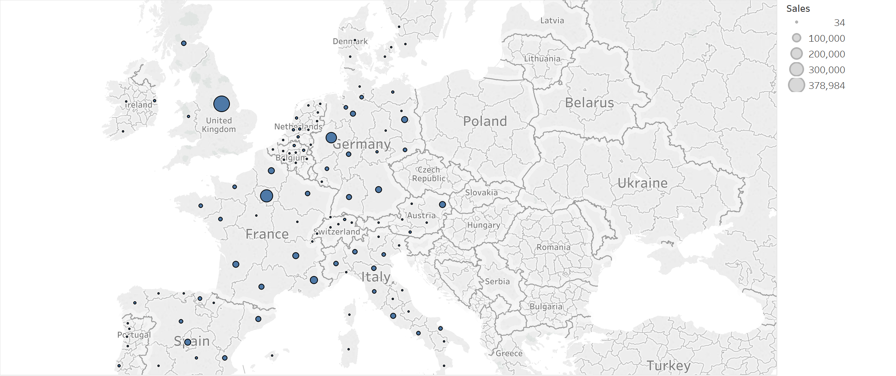
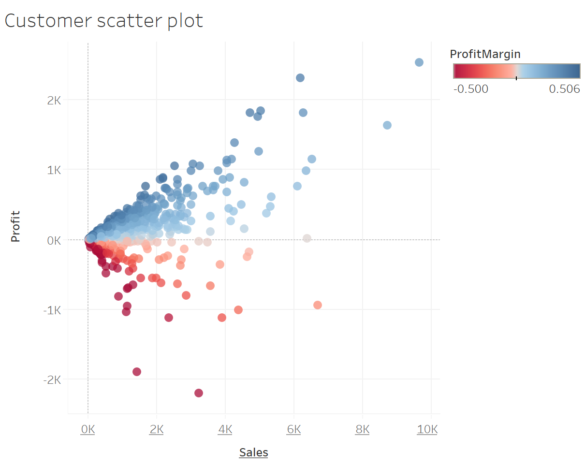

# This is challenge to describe following things:-
---
* ScatterPlots.
* Applying filters to multiple sheets. 
* How to create Dashboards.
* How to add an interactive action-filter
---
> 1. **Hover**  2. **Select** 3. **Menu**

* How to create an action manually.
* Applying highlighting actions.
---

Difference between Highlighting and filter action:
---
 filter actions reconstruct based on actions, and removes others whereas highlights does not deletes others while highlighting the necessary ones.

1. 
#### This is the image which is displaying the profitmargins and sales, profit margins are being described through colors, sales based on size.

2. 
#### This is customer scatter plot which is describing for each sales, how much profit for some specific year selected, profit margin is being described through color

