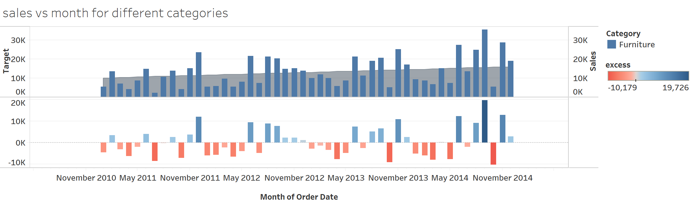

# This is a challenge for learning blends, dual - axis and their synchroniztion.
---

### This is displaying sales for the dates and on the top of it, displaying target for different categories.

### Here you can see the sales for the different months of a year.

### Its is showing the graph and the difference between the target and sales for different months.